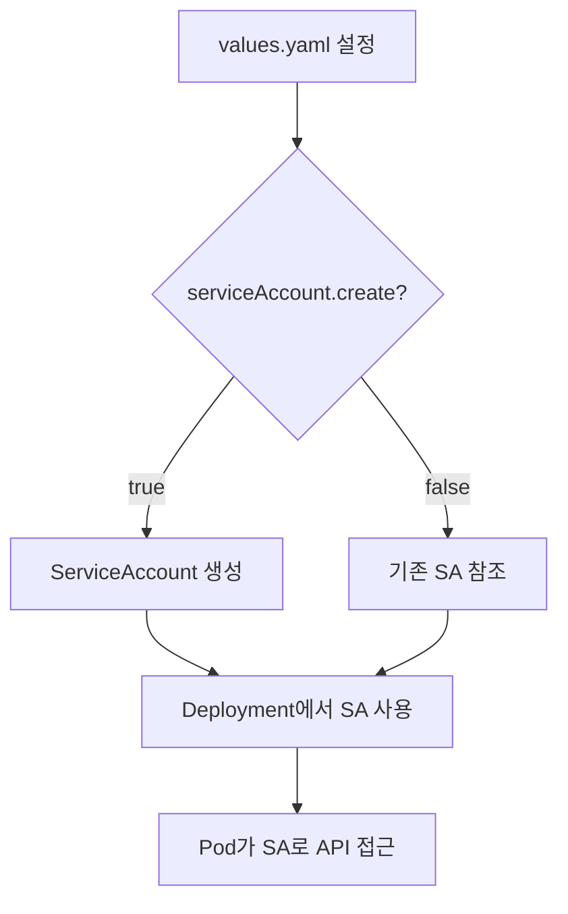
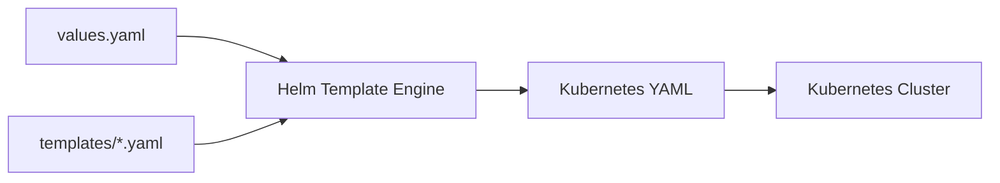

### 참고문서

- https://helm.sh/docs/chart_template_guide

# 1. Helm Chart \_helpers.tpl 파일 상세 가이드

## 개요

**\_helpers.tpl**은 Helm Chart의 `templates/` 폴더에 위치하는 partial 템플릿 모음 파일입니다.

### 주요 특징

- Helm은 파일 이름이 `_`(underscore)로 시작하는 파일은 렌더링 대상이 아닌 템플릿 헬퍼로만 사용
- 여기에 정의된 템플릿은 `{{ include "..." . }}` 혹은 `{{ template "..." . }}`로 다른 템플릿 파일에서 불러와 사용 가능

---

## 템플릿 함수들

### 1. puretension-service.name

```go
{{- define "puretension-service.name" -}}
{{- default .Chart.Name .Values.nameOverride | trunc 63 | trimSuffix "-" }}
{{- end }}
```

**기능:**

- `.Values.nameOverride` 값이 있으면 그걸 사용하고, 없으면 `.Chart.Name` 사용
- 63자 제한, 마지막에 `-` 제거 → DNS 규격을 따르기 위함

**예시 결과:** `myrelease-puretension`

---

### 2. puretension-service.fullname

```go
{{/*
Create a default fully qualified app name.
We truncate at 63 chars because some Kubernetes name fields are limited to this (by the DNS naming spec).
If release name contains chart name it will be used as a full name.
*/}}
{{- define "puretension-service.fullname" -}}
{{- if .Values.fullnameOverride }}
{{- .Values.fullnameOverride | trunc 63 | trimSuffix "-" }}
{{- else }}
{{- $name := default .Chart.Name .Values.nameOverride }}
{{- if contains $name .Release.Name }}
{{- .Release.Name | trunc 63 | trimSuffix "-" }}
{{- else }}
{{- printf "%s-%s" .Release.Name $name | trunc 63 | trimSuffix "-" }}
{{- end }}
{{- end }}
{{- end }}
```

**기능:**

- `.Values.fullnameOverride`가 있으면 그 값을 사용
- 없으면:
  - `Release.Name` 안에 `.Chart.Name`이 포함되어 있으면 `Release.Name` 사용
  - 그렇지 않으면 `Release.Name-Chart.Name` 형태 사용
- `trunc 63` 및 `trimSuffix "-"` 포함

**예시 결과:** `myrelease-puretension`

---

### 3. puretension-service.chart

```go
{{- define "puretension-service.chart" -}}
{{- printf "%s-%s" .Chart.Name .Chart.Version | replace "+" "_" | trunc 63 | trimSuffix "-" }}
{{- end }}
```

**기능:**

- `Chart.Name`과 `Chart.Version`을 붙여 사용
- Helm의 `+` 기호는 YAML에서 문제가 될 수 있어 `_`로 변경
- 63자 제한 포함

**예시 결과:** `puretension-service-1.0.0`

---

### 4. puretension-service.labels

```go
{{- define "puretension-service.labels" -}}
helm.sh/chart: {{ include "puretension-service.chart" . }}
{{ include "puretension-service.selectorLabels" . }}
{{- if .Chart.AppVersion }}
app.kubernetes.io/version: {{ .Chart.AppVersion | quote }}
{{- end }}
app.kubernetes.io/managed-by: {{ .Release.Service }}
{{- end }}
```

**기능:**

- 공통 Kubernetes label 세트 정의
- 차트 정보, 버전, 관리 서비스 명칭 등 포함
- 내부적으로 `selectorLabels` 템플릿도 포함

**출력 예시:**

```yaml
helm.sh/chart: puretension-service-1.0.0
app.kubernetes.io/name: puretension
app.kubernetes.io/instance: myrelease
app.kubernetes.io/version: "1.0.0"
app.kubernetes.io/managed-by: Helm
```

---

### 5. puretension-service.selectorLabels

```go
{{- define "puretension-service.selectorLabels" -}}
app.kubernetes.io/name: {{ include "puretension-service.name" . }}
app.kubernetes.io/instance: {{ .Release.Name }}
{{- end }}
```

**기능:**

- selector 용 레이블만 분리해 정의
- 보통 `Deployment.spec.selector.matchLabels` 등에서 사용

**출력 예시:**

```yaml
app.kubernetes.io/name: puretension
app.kubernetes.io/instance: myrelease
```

---

### 6. puretension-service.serviceAccountName

```go
{{- define "puretension-service.serviceAccountName" -}}
{{- if .Values.serviceAccount.create }}
{{- default (include "puretension-service.fullname" .) .Values.serviceAccount.name }}
{{- else }}
{{- default "default" .Values.serviceAccount.name }}
{{- end }}
{{- end }}
```

**기능:**

- `.Values.serviceAccount.create`가 `true`면:
  - 이름이 있으면 그걸 사용하고, 없으면 `fullname` 사용
- `false`면:
  - 이름 있으면 그걸 사용, 없으면 `"default"` 사용

**결과:** `puretension-release`

---

## 템플릿 사용 예시

**deployment.yaml** 등에서:

```yaml
metadata:
  name: { { include "puretension-service.fullname" . } }
  labels: { { include "puretension-service.labels" . | nindent 4 } }
spec:
  selector:
    matchLabels:
      { { include "puretension-service.selectorLabels" . | nindent 6 } }
```

---

## 템플릿 함수 요약표

| 템플릿 이름          | 용도                                 |
| -------------------- | ------------------------------------ |
| `name`               | 기본 이름 결정 (nameOverride 지원)   |
| `fullname`           | 전체 리소스 이름 결정 (Release 기반) |
| `chart`              | Chart 이름+버전 출력                 |
| `labels`             | 공통 메타데이터 라벨 묶음            |
| `selectorLabels`     | selector match용 라벨 묶음           |
| `serviceAccountName` | 서비스어카운트 이름 결정             |

# 2. Helm Chart deployment.yaml 상세 가이드

이 `deployment.yaml` 파일은 Kubernetes Deployment 리소스를 정의하는 Helm 템플릿입니다.

## 전체 구조 분석

### 1. Metadata 섹션

```yaml
apiVersion: apps/v1
kind: Deployment
metadata:
  name: { { include "puretension-service.fullname" . } }
  labels: { { - include "puretension-service.labels" . | nindent 4 } }
```

**설명:**

- `name`: `_helpers.tpl`의 `fullname` 템플릿을 사용하여 Deployment 이름 생성
- `labels`: 공통 라벨을 4칸 들여쓰기로 적용

**결과 예시:**

```yaml
metadata:
  name: myrelease-puretension-service
  labels:
    helm.sh/chart: puretension-service-1.0.0
    app.kubernetes.io/name: puretension-service
    app.kubernetes.io/instance: myrelease
```

---

### 2. Spec 섹션 - 기본 설정

```yaml
spec:
  {{- if not .Values.autoscaling.enabled }}
  replicas: {{ .Values.replicaCount }}
  {{- end }}
  selector:
    matchLabels:
      {{- include "puretension-service.selectorLabels" . | nindent 6 }}
```

**설명:**

- **조건부 replicas**: `autoscaling`이 비활성화된 경우에만 `replicaCount` 설정
- **selector**: Pod를 선택하기 위한 라벨 셀렉터 (6칸 들여쓰기)

**결과 예시:**

```yaml
spec:
  replicas: 3 # autoscaling.enabled가 false일 때만
  selector:
    matchLabels:
      app.kubernetes.io/name: puretension-service
      app.kubernetes.io/instance: myrelease
```

---

### 3. Pod 템플릿 - Metadata

```yaml
template:
  metadata:
    {{- with .Values.podAnnotations }}
    annotations:
      {{- toYaml . | nindent 8 }}
    {{- end }}
    labels:
      {{- include "puretension-service.selectorLabels" . | nindent 8 }}
```

**설명:**

- **`with` 구문**: `podAnnotations`가 존재할 때만 annotations 섹션 생성
- **`toYaml`**: YAML 형태로 변환하여 8칸 들여쓰기
- **labels**: selector용 라벨을 Pod에도 적용

**values.yaml 예시:**

```yaml
podAnnotations:
  prometheus.io/scrape: "true"
  prometheus.io/port: "8080"
```

---

### 4. Pod 템플릿 - Spec

```yaml
spec:
  {{- with .Values.imagePullSecrets }}
  imagePullSecrets:
    {{- toYaml . | nindent 8 }}
  {{- end }}
  serviceAccountName: {{ include "puretension-service.serviceAccountName" . }}
  securityContext:
    {{- toYaml .Values.podSecurityContext | nindent 8 }}
```

**설명:**

- **imagePullSecrets**: 프라이빗 레지스트리 접근용 시크릿 (조건부)
- **serviceAccountName**: `_helpers.tpl`에서 정의한 서비스 어카운트명
- **securityContext**: Pod 레벨 보안 컨텍스트

---

### 5. Container 정의

```yaml
containers:
  - name: { { .Chart.Name } }
    securityContext: { { - toYaml .Values.securityContext | nindent 12 } }
    image: "{{ .Values.image.name }}:{{ .Values.image.tag }}"
    imagePullPolicy: { { .Values.image.pullPolicy } }
```

**설명:**

- **name**: 차트 이름을 컨테이너명으로 사용
- **securityContext**: 컨테이너 레벨 보안 설정 (12칸 들여쓰기)
- **image**: 이미지명과 태그를 조합하여 전체 이미지 경로 생성

**values.yaml 예시:**

```yaml
image:
  name: myregistry/puretension-service
  tag: v1.2.3
  pullPolicy: IfNotPresent
```

---

### 6. 포트 및 Health Check

```yaml
ports:
  - name: http
    containerPort: 8080
    protocol: TCP
livenessProbe:
  httpGet:
    path: /healthcheck
    port: http
  initialDelaySeconds: 30
  periodSeconds: 10
readinessProbe:
  httpGet:
    path: /healthcheck
    port: http
  initialDelaySeconds: 5
  periodSeconds: 5
```

**설명:**

- **ports**: HTTP 포트 8080을 `http`라는 이름으로 노출
- **livenessProbe**: 컨테이너 생존 확인 (30초 후 시작, 10초마다 체크)
- **readinessProbe**: 트래픽 수신 준비 확인 (5초 후 시작, 5초마다 체크)

---

### 7. 리소스 및 환경변수

```yaml
resources:
  {{- toYaml .Values.resources | nindent 12 }}
env:
  {{- range .Values.env }}
  - name: {{ .name }}
    value: {{ .value | quote }}
  {{- end }}
```

**설명:**

- **resources**: CPU/메모리 요청 및 제한 설정
- **env**: `range` 구문으로 환경변수 배열 순회하여 생성

**values.yaml 예시:**

```yaml
resources:
  requests:
    cpu: 100m
    memory: 128Mi
  limits:
    cpu: 500m
    memory: 512Mi

env:
  - name: DATABASE_URL
    value: "postgresql://localhost:5432/mydb"
  - name: LOG_LEVEL
    value: "INFO"
```

---

### 8. Node 스케줄링 설정

```yaml
{{- with .Values.nodeSelector }}
nodeSelector:
  {{- toYaml . | nindent 8 }}
{{- end }}
{{- with .Values.affinity }}
affinity:
  {{- toYaml . | nindent 8 }}
{{- end }}
{{- with .Values.tolerations }}
tolerations:
  {{- toYaml . | nindent 8 }}
{{- end }}
```

**설명:**

- **nodeSelector**: 특정 노드에 Pod 스케줄링
- **affinity**: 노드/Pod 친화성 규칙
- **tolerations**: 노드 taint 허용 설정
- 모두 `with` 구문으로 조건부 생성

---

## 주요 Helm 템플릿 문법 요약

| 문법            | 설명             | 예시                                             |
| --------------- | ---------------- | ------------------------------------------------ | ------------ | ------------- |
| `{{ include }}` | 다른 템플릿 포함 | `{{ include "puretension-service.fullname" . }}` |
| `{{- if }}`     | 조건문           | `{{- if not .Values.autoscaling.enabled }}`      |
| `{{- with }}`   | 존재 여부 체크   | `{{- with .Values.podAnnotations }}`             |
| `{{- range }}`  | 배열 순회        | `{{- range .Values.env }}`                       |
| `               | nindent N`       | N칸 들여쓰기                                     | `{{ toYaml . | nindent 8 }}` |
| `               | quote`           | 따옴표 추가                                      | `{{ .value   | quote }}`     |

## 핵심 포인트

1. **모든 설정이 values.yaml에서 제어 가능**
2. **조건부 렌더링으로 유연한 설정** (`with`, `if` 사용)
3. **\_helpers.tpl 템플릿 재사용으로 일관성 유지**
4. **들여쓰기 정확성**이 YAML 파싱에 중요
5. **보안 설정, Health Check, 리소스 제한** 등 프로덕션 환경 고려

이 템플릿은 대부분의 일반적인 애플리케이션 배포 시나리오를 커버하는 잘 구성된 Deployment 템플릿입니다.

# 3. HPA 템플릿 상세 가이드

이 템플릿은 Kubernetes HorizontalPodAutoscaler(HPA)를 정의하여 자동 스케일링을 구현합니다.

## 전체 구조 분석

### 1. 조건부 렌더링

```yaml
{{- if .Values.autoscaling.enabled }}
# HPA 정의
{{- end }}
```

**설명:**

- `autoscaling.enabled`가 `true`일 때만 HPA 리소스 생성
- `deployment.yaml`에서 `replicas` 설정과 상호 배타적 관계

---

### 2. API 버전 및 기본 정보

```yaml
apiVersion: autoscaling/v2
kind: HorizontalPodAutoscaler
metadata:
  name: { { include "puretension-service.fullname" . } }
  labels: { { - include "puretension-service.labels" . | nindent 4 } }
```

**설명:**

- **apiVersion**: `autoscaling/v2` 사용 (최신 HPA API)
- **name**: Deployment와 동일한 이름 사용 (`fullname` 템플릿)
- **labels**: 공통 라벨 적용 (4칸 들여쓰기)

**결과 예시:**

```yaml
apiVersion: autoscaling/v2
kind: HorizontalPodAutoscaler
metadata:
  name: myrelease-puretension-service
  labels:
    helm.sh/chart: puretension-service-1.0.0
    app.kubernetes.io/name: puretension-service
    app.kubernetes.io/instance: myrelease
```

---

### 3. 스케일 대상 설정

```yaml
spec:
  scaleTargetRef:
    apiVersion: apps/v1
    kind: Deployment
    name: { { include "puretension-service.fullname" . } }
```

**설명:**

- **scaleTargetRef**: 스케일링할 대상 리소스 지정
- Deployment를 대상으로 하며, 동일한 `fullname` 사용
- HPA가 이 Deployment의 replica 수를 자동 조절

---

### 4. 스케일링 범위 설정

```yaml
minReplicas: { { .Values.autoscaling.minReplicas } }
maxReplicas: { { .Values.autoscaling.maxReplicas } }
```

**설명:**

- **minReplicas**: 최소 Pod 수 (스케일 다운 제한)
- **maxReplicas**: 최대 Pod 수 (스케일 업 제한)

**values.yaml 예시:**

```yaml
autoscaling:
  enabled: true
  minReplicas: 2
  maxReplicas: 10
```

---

### 5. CPU 기반 메트릭 (조건부)

```yaml
metrics:
  {{- if .Values.autoscaling.targetCPUUtilizationPercentage }}
  - type: Resource
    resource:
      name: cpu
      target:
        type: Utilization
        averageUtilization: {{ .Values.autoscaling.targetCPUUtilizationPercentage }}
  {{- end }}
```

**설명:**

- **조건부 CPU 메트릭**: `targetCPUUtilizationPercentage`가 설정된 경우에만 추가
- **type: Resource**: Kubernetes 리소스 기반 메트릭
- **averageUtilization**: CPU 사용률 기준 (백분율)

**동작 방식:**

- CPU 사용률이 설정값을 초과하면 Pod 증가
- CPU 사용률이 설정값보다 낮으면 Pod 감소

---

### 6. 메모리 기반 메트릭 (조건부)

```yaml
{{- if .Values.autoscaling.targetMemoryUtilizationPercentage }}
- type: Resource
  resource:
    name: memory
    target:
      type: Utilization
      averageUtilization: {{ .Values.autoscaling.targetMemoryUtilizationPercentage }}
{{- end }}
```

**설명:**

- **조건부 메모리 메트릭**: `targetMemoryUtilizationPercentage`가 설정된 경우에만 추가
- CPU 메트릭과 동일한 구조, 메모리 사용률 기준

---

## values.yaml 설정 예시

```yaml
# 기본 replica 설정 (autoscaling 비활성화 시 사용)
replicaCount: 3

# Autoscaling 설정
autoscaling:
  enabled: true
  minReplicas: 2
  maxReplicas: 10
  targetCPUUtilizationPercentage: 70
  targetMemoryUtilizationPercentage: 80
```

---

## 결과 YAML 예시

위 설정으로 렌더링하면:

```yaml
apiVersion: autoscaling/v2
kind: HorizontalPodAutoscaler
metadata:
  name: myrelease-puretension-service
  labels:
    helm.sh/chart: puretension-service-1.0.0
    app.kubernetes.io/name: puretension-service
    app.kubernetes.io/instance: myrelease
spec:
  scaleTargetRef:
    apiVersion: apps/v1
    kind: Deployment
    name: myrelease-puretension-service
  minReplicas: 2
  maxReplicas: 10
  metrics:
    - type: Resource
      resource:
        name: cpu
        target:
          type: Utilization
          averageUtilization: 70
    - type: Resource
      resource:
        name: memory
        target:
          type: Utilization
          averageUtilization: 80
```

---

## Deployment와의 연동

### deployment.yaml에서의 조건부 replicas

```yaml
spec:
  {{- if not .Values.autoscaling.enabled }}
  replicas: {{ .Values.replicaCount }}
  {{- end }}
```

**연동 로직:**

- `autoscaling.enabled = true` → HPA 생성, Deployment에서 `replicas` 제거
- `autoscaling.enabled = false` → HPA 생성 안 함, Deployment에서 `replicas` 설정

---

## 주요 특징

| 기능            | 설명                                         |
| --------------- | -------------------------------------------- |
| **조건부 생성** | `autoscaling.enabled`로 HPA 활성화/비활성화  |
| **이중 메트릭** | CPU와 메모리 사용률 모두 모니터링 가능       |
| **유연한 설정** | 각 메트릭을 독립적으로 활성화/비활성화       |
| **안전한 범위** | minReplicas/maxReplicas로 스케일링 범위 제한 |

---

## 모범 사례

### 1. 리소스 요청 설정 필수

```yaml
# deployment.yaml의 resources 섹션
resources:
  requests:
    cpu: 100m # HPA가 CPU 사용률을 계산하기 위해 필요
    memory: 128Mi # HPA가 메모리 사용률을 계산하기 위해 필요
```

### 2. 적절한 임계값 설정

- **CPU**: 일반적으로 70-80%
- **메모리**: 80-90% (메모리는 급격히 증가할 수 있음)

### 3. 최소/최대 replica 설정

- **minReplicas**: 최소 가용성 보장
- **maxReplicas**: 비용 제어 및 리소스 보호

이 HPA 템플릿은 프로덕션 환경에서 자동 스케일링을 안전하고 유연하게 구현할 수 있도록 잘 설계되어 있습니다.

# 4. Helm Chart Service 템플릿 상세 가이드

이 템플릿은 Kubernetes Service 리소스를 정의하여 Pod들에 대한 네트워크 접근을 제공합니다.

## 전체 구조 분석

### 1. API 버전 및 기본 정보

```yaml
apiVersion: v1
kind: Service
metadata:
  name: { { include "puretension-service.fullname" . } }
  labels: { { - include "puretension-service.labels" . | nindent 4 } }
```

**설명:**

- **apiVersion**: `v1` (Service는 core API 그룹)
- **name**: `_helpers.tpl`의 `fullname` 템플릿 사용 (Deployment와 동일한 이름)
- **labels**: 공통 라벨을 4칸 들여쓰기로 적용

**결과 예시:**

```yaml
apiVersion: v1
kind: Service
metadata:
  name: myrelease-puretension-service
  labels:
    helm.sh/chart: puretension-service-1.0.0
    app.kubernetes.io/name: puretension-service
    app.kubernetes.io/instance: myrelease
    app.kubernetes.io/managed-by: Helm
```

---

### 2. Service 타입 설정

```yaml
spec:
  type: { { .Values.service.type } }
```

**설명:**

- `values.yaml`에서 정의된 서비스 타입 사용
- Kubernetes에서 지원하는 Service 타입들 모두 지원

**Service 타입별 특징:**

| 타입             | 설명                         | 사용 사례           |
| ---------------- | ---------------------------- | ------------------- |
| **ClusterIP**    | 클러스터 내부에서만 접근     | 내부 마이크로서비스 |
| **NodePort**     | 모든 노드의 특정 포트로 접근 | 개발/테스트 환경    |
| **LoadBalancer** | 클라우드 로드밸런서 사용     | 프로덕션 외부 노출  |
| **ExternalName** | DNS 이름 매핑                | 외부 서비스 연결    |

---

### 3. 포트 설정

```yaml
ports:
  - port: { { .Values.service.port } }
    targetPort: http
    protocol: TCP
    name: http
```

**설명:**

- **port**: 서비스가 노출하는 포트 (외부에서 접근하는 포트)
- **targetPort**: Pod 내 컨테이너 포트 (`http`는 deployment.yaml에서 정의한 포트명)
- **protocol**: TCP 프로토콜 사용
- **name**: 포트에 `http`라는 이름 부여

**연동 관계:**

```yaml
# deployment.yaml에서
ports:
  - name: http # ← 여기서 정의한 이름
    containerPort: 8080

# service.yaml에서
targetPort: http # ← 위 이름을 참조
```

---

### 4. NodePort 조건부 설정

```yaml
{{- if eq .Values.service.type "NodePort" }}
nodePort: {{ .Values.service.nodePort }}
{{- end }}
```

**설명:**

- **조건부 렌더링**: 서비스 타입이 `NodePort`일 때만 `nodePort` 필드 추가
- **eq 함수**: 문자열 비교 (`eq "NodePort" .Values.service.type`와 동일)
- **nodePort**: 노드에서 사용할 특정 포트 번호 (30000-32767 범위)

**NodePort 동작:**

- 클러스터의 모든 노드에서 `nodePort`로 접근 가능
- `NodeIP:NodePort` → `Service:Port` → `Pod:TargetPort`

---

### 5. Pod 셀렉터

```yaml
selector: { { - include "puretension-service.selectorLabels" . | nindent 4 } }
```

**설명:**

- **selector**: 이 서비스가 트래픽을 전달할 Pod들을 선택
- `_helpers.tpl`의 `selectorLabels` 템플릿 사용 (4칸 들여쓰기)
- Deployment의 Pod 템플릿과 동일한 라벨 사용

**연동 확인:**

```yaml
# deployment.yaml - Pod template labels
template:
  metadata:
    labels:
      app.kubernetes.io/name: puretension-service
      app.kubernetes.io/instance: myrelease

# service.yaml - selector
selector:
  app.kubernetes.io/name: puretension-service
  app.kubernetes.io/instance: myrelease
```

---

## values.yaml 설정 예시

### 기본 설정 (ClusterIP)

```yaml
service:
  type: ClusterIP
  port: 80
```

### NodePort 설정

```yaml
service:
  type: NodePort
  port: 80
  nodePort: 30080
```

### LoadBalancer 설정

```yaml
service:
  type: LoadBalancer
  port: 80
```

---

## 결과 YAML 예시

### ClusterIP 타입

```yaml
apiVersion: v1
kind: Service
metadata:
  name: myrelease-puretension-service
  labels:
    helm.sh/chart: puretension-service-1.0.0
    app.kubernetes.io/name: puretension-service
    app.kubernetes.io/instance: myrelease
spec:
  type: ClusterIP
  ports:
    - port: 80
      targetPort: http
      protocol: TCP
      name: http
  selector:
    app.kubernetes.io/name: puretension-service
    app.kubernetes.io/instance: myrelease
```

### NodePort 타입

```yaml
apiVersion: v1
kind: Service
metadata:
  name: myrelease-puretension-service
  labels:
    helm.sh/chart: puretension-service-1.0.0
    app.kubernetes.io/name: puretension-service
    app.kubernetes.io/instance: myrelease
spec:
  type: NodePort
  ports:
    - port: 80
      targetPort: http
      protocol: TCP
      name: http
      nodePort: 30080
  selector:
    app.kubernetes.io/name: puretension-service
    app.kubernetes.io/instance: myrelease
```

---

## 트래픽 플로우

```
외부 클라이언트
      ↓
   Service (port: 80)
      ↓
   Pod (targetPort: http → 8080)
      ↓
   Container (containerPort: 8080)
```

**포트 매핑:**

- **Service Port**: 80 (외부에서 접근)
- **Target Port**: `http` (Pod의 named port)
- **Container Port**: 8080 (실제 애플리케이션 포트)

---

## 핵심 Helm 템플릿 기법

| 기법            | 용도                | 예시                                             |
| --------------- | ------------------- | ------------------------------------------------ | ------------------- | ------------- |
| `{{ include }}` | 템플릿 재사용       | `{{ include "puretension-service.fullname" . }}` |
| `{{- if eq }}`  | 문자열 비교 조건문  | `{{- if eq .Values.service.type "NodePort" }}`   |
| `               | nindent N`          | N칸 들여쓰기                                     | `{{ include "..." . | nindent 4 }}` |
| `.Values.*`     | values.yaml 값 참조 | `{{ .Values.service.port }}`                     |

---

## 모범 사례

### 1. 일관된 이름 사용

```yaml
# 모든 리소스가 동일한 fullname 사용
# Deployment, Service, HPA 등
name: { { include "puretension-service.fullname" . } }
```

### 2. Named Port 활용

```yaml
# Deployment에서 포트에 이름 부여
ports:
  - name: http
    containerPort: 8080

# Service에서 이름으로 참조 (포트 번호 변경 시 유연성)
targetPort: http
```

### 3. 일관된 라벨 셀렉터

```yaml
# _helpers.tpl에서 selectorLabels 정의
# Deployment와 Service에서 동일하게 사용
selector: { { - include "puretension-service.selectorLabels" . | nindent 4 } }
```

### 4. 서비스 타입별 최적화

**개발 환경:**

```yaml
service:
  type: NodePort
  port: 80
  nodePort: 30080
```

**프로덕션 환경:**

```yaml
service:
  type: LoadBalancer
  port: 80
```

---

## 추가 확장 가능성

### 멀티 포트 지원

```yaml
ports:
  - port: {{ .Values.service.port }}
    targetPort: http
    protocol: TCP
    name: http
  {{- if .Values.service.metrics.enabled }}
  - port: {{ .Values.service.metrics.port }}
    targetPort: metrics
    protocol: TCP
    name: metrics
  {{- end }}
```

### 어노테이션 지원

```yaml
metadata:
  name: {{ include "puretension-service.fullname" . }}
  labels:
    {{- include "puretension-service.labels" . | nindent 4 }}
  {{- with .Values.service.annotations }}
  annotations:
    {{- toYaml . | nindent 4 }}
  {{- end }}
```

# 5. Helm Chart ServiceAccount 템플릿 상세 가이드

이 템플릿은 Kubernetes ServiceAccount 리소스를 정의하여 Pod에 대한 인증 및 권한 관리를 제공합니다.

## 전체 구조 분석

### 1. 조건부 생성

```yaml
{{- if .Values.serviceAccount.create -}}
# ServiceAccount 정의
{{- end }}
```

**설명:**

- `serviceAccount.create`가 `true`일 때만 ServiceAccount 리소스 생성
- `false`면 기본 ServiceAccount 사용하거나 기존 ServiceAccount 참조

---

### 2. API 버전 및 기본 정보

```yaml
apiVersion: v1
kind: ServiceAccount
metadata:
  name: { { include "puretension-service.serviceAccountName" . } }
  labels: { { - include "puretension-service.labels" . | nindent 4 } }
```

**설명:**

- **apiVersion**: `v1` (ServiceAccount는 core API 그룹)
- **name**: `_helpers.tpl`의 `serviceAccountName` 템플릿 사용
- **labels**: 공통 라벨을 4칸 들여쓰기로 적용

**결과 예시:**

```yaml
apiVersion: v1
kind: ServiceAccount
metadata:
  name: myrelease-puretension-service
  labels:
    helm.sh/chart: puretension-service-1.0.0
    app.kubernetes.io/name: puretension-service
    app.kubernetes.io/instance: myrelease
    app.kubernetes.io/managed-by: Helm
```

---

### 3. 어노테이션 (조건부)

```yaml
{{- with .Values.serviceAccount.annotations }}
annotations:
  {{- toYaml . | nindent 4 }}
{{- end }}
```

**설명:**

- **`with` 구문**: `serviceAccount.annotations`가 존재할 때만 annotations 섹션 생성
- **`toYaml`**: YAML 형태로 변환하여 4칸 들여쓰기
- 주로 IRSA(IAM Roles for Service Accounts) 등의 클라우드 권한 설정에 사용

---

## \_helpers.tpl의 serviceAccountName 템플릿 연동

### \_helpers.tpl에서의 로직

```go
{{- define "puretension-service.serviceAccountName" -}}
{{- if .Values.serviceAccount.create }}
{{- default (include "puretension-service.fullname" .) .Values.serviceAccount.name }}
{{- else }}
{{- default "default" .Values.serviceAccount.name }}
{{- end }}
{{- end }}
```

### 로직 분석

| 조건         | serviceAccount.create | serviceAccount.name | 결과                            |
| ------------ | --------------------- | ------------------- | ------------------------------- |
| **케이스 1** | `true`                | 설정됨              | 설정된 이름 사용                |
| **케이스 2** | `true`                | 설정 안됨           | fullname 사용                   |
| **케이스 3** | `false`               | 설정됨              | 설정된 이름 사용 (기존 SA 참조) |
| **케이스 4** | `false`               | 설정 안됨           | `"default"` 사용                |

---

## values.yaml 설정 예시

### 1. 기본 ServiceAccount 생성

```yaml
serviceAccount:
  create: true
  # name은 설정하지 않음 → fullname 사용
  annotations: {}
```

### 2. 커스텀 이름 ServiceAccount 생성

```yaml
serviceAccount:
  create: true
  name: "custom-service-account"
  annotations: {}
```

### 3. AWS IRSA 설정

```yaml
serviceAccount:
  create: true
  annotations:
    eks.amazonaws.com/role-arn: arn:aws:iam::123456789012:role/MyRole
```

### 4. 기존 ServiceAccount 사용

```yaml
serviceAccount:
  create: false
  name: "existing-service-account"
```

### 5. Default ServiceAccount 사용

```yaml
serviceAccount:
  create: false
  # name 설정 안함 → "default" 사용
```

---

## 결과 YAML 예시

### 기본 생성 (create: true, name 없음)

```yaml
apiVersion: v1
kind: ServiceAccount
metadata:
  name: myrelease-puretension-service
  labels:
    helm.sh/chart: puretension-service-1.0.0
    app.kubernetes.io/name: puretension-service
    app.kubernetes.io/instance: myrelease
    app.kubernetes.io/managed-by: Helm
```

### AWS IRSA 어노테이션 포함

```yaml
apiVersion: v1
kind: ServiceAccount
metadata:
  name: myrelease-puretension-service
  labels:
    helm.sh/chart: puretension-service-1.0.0
    app.kubernetes.io/name: puretension-service
    app.kubernetes.io/instance: myrelease
    app.kubernetes.io/managed-by: Helm
  annotations:
    eks.amazonaws.com/role-arn: arn:aws:iam::123456789012:role/MyRole
```

---

## Deployment와의 연동

### deployment.yaml에서 사용

```yaml
spec:
  template:
    spec:
      serviceAccountName:
        { { include "puretension-service.serviceAccountName" . } }
```

**연동 시나리오:**

1. **ServiceAccount 생성 시**:

   - `serviceaccount.yaml`에서 SA 생성
   - `deployment.yaml`에서 해당 SA 참조

2. **기존 ServiceAccount 사용 시**:
   - `serviceaccount.yaml`은 렌더링되지 않음
   - `deployment.yaml`에서 기존 SA 이름 참조

---

## ServiceAccount의 주요 용도

### 1. 기본 인증

```yaml
# Pod가 Kubernetes API에 접근할 때 사용할 인증 정보
apiVersion: v1
kind: ServiceAccount
metadata:
  name: myapp-sa
```

### 2. 클라우드 권한 (IRSA - AWS)

```yaml
apiVersion: v1
kind: ServiceAccount
metadata:
  name: myapp-sa
  annotations:
    eks.amazonaws.com/role-arn: arn:aws:iam::123456789012:role/S3AccessRole
```

### 3. 클라우드 권한 (Workload Identity - GCP)

```yaml
apiVersion: v1
kind: ServiceAccount
metadata:
  name: myapp-sa
  annotations:
    iam.gke.io/gcp-service-account: myapp-sa@project.iam.gserviceaccount.com
```

### 4. 이미지 풀 시크릿

```yaml
apiVersion: v1
kind: ServiceAccount
metadata:
  name: myapp-sa
imagePullSecrets:
  - name: private-registry-secret
```

---

## 보안 관련 모범 사례

### 1. 최소 권한 원칙

```yaml
# 각 애플리케이션마다 별도의 ServiceAccount 생성
serviceAccount:
  create: true
  name: "myapp-specific-sa"
```

### 2. 자동 토큰 마운트 비활성화 (필요시)

```yaml
apiVersion: v1
kind: ServiceAccount
metadata:
  name: myapp-sa
automountServiceAccountToken: false # API 접근 불필요시
```

### 3. 어노테이션을 통한 추가 보안 설정

```yaml
serviceAccount:
  create: true
  annotations:
    # AWS IRSA
    eks.amazonaws.com/role-arn: arn:aws:iam::123456789012:role/MyRole
    # 토큰 만료 시간 설정
    eks.amazonaws.com/token-expiration: "86400"
```

---

## 핵심 Helm 템플릿 기법

| 기법            | 용도               | 예시                                                       |
| --------------- | ------------------ | ---------------------------------------------------------- | ------------- |
| `{{- if }}`     | 조건부 리소스 생성 | `{{- if .Values.serviceAccount.create -}}`                 |
| `{{ include }}` | 헬퍼 템플릿 사용   | `{{ include "puretension-service.serviceAccountName" . }}` |
| `{{- with }}`   | 존재 여부 체크     | `{{- with .Values.serviceAccount.annotations }}`           |
| `toYaml`        | 객체를 YAML로 변환 | `{{- toYaml .                                              | nindent 4 }}` |

---

## 전체 워크플로우



**단계별 설명:**

1. `values.yaml`에서 ServiceAccount 설정 정의
2. `create: true`면 새 ServiceAccount 생성, `false`면 기존 것 참조
3. `deployment.yaml`에서 해당 ServiceAccount 이름 사용
4. Pod가 실행되면서 ServiceAccount 토큰으로 Kubernetes API 접근

---

## 주요 사용 사례

### 개발 환경

```yaml
serviceAccount:
  create: true
  annotations: {}
```

### AWS 환경 (S3 접근 필요)

```yaml
serviceAccount:
  create: true
  annotations:
    eks.amazonaws.com/role-arn: arn:aws:iam::123456789012:role/S3AccessRole
```

### 마이크로서비스 환경 (서비스별 권한 분리)

```yaml
serviceAccount:
  create: true
  name: "user-service-sa" # 서비스별 고유 SA
```

이 ServiceAccount 템플릿은 **보안성**과 **유연성**을 모두 고려한 잘 설계된 템플릿으로, 다양한 클라우드 환경과 보안 요구사항에 대응할 수 있습니다.

# 6. Helm Chart Chart.yaml 상세 가이드

`Chart.yaml` 파일은 Helm 차트의 메타데이터를 정의하는 필수 파일로, 차트의 기본 정보와 의존성을 관리합니다.

## 전체 구조 분석

### 1. API 버전 및 기본 정보

```yaml
apiVersion: v2
name: puretension-service
description: A Helm chart for Puretension Web Service
type: application
```

**설명:**

- **apiVersion**: Helm 차트 스키마 버전 (`v2`는 Helm 3.x용)
- **name**: 차트 이름 (디렉토리명과 일치해야 함)
- **description**: 차트에 대한 간단한 설명
- **type**: 차트 타입 (`application` 또는 `library`)

**Chart 타입:**
| 타입 | 설명 | 용도 |
|------|------|------|
| **application** | 기본 애플리케이션 차트 | 실제 배포 가능한 서비스 |
| **library** | 공유 라이브러리 차트 | 다른 차트에서 사용할 공통 템플릿 |

---

### 2. 버전 관리

```yaml
version: 0.1.0
appVersion: "1.0.0"
```

**설명:**

- **version**: 차트 자체의 버전 (SemVer 형식)
- **appVersion**: 차트가 배포하는 애플리케이션의 버전

**버전 차이점:**

```yaml
# 차트 버전 (차트 구조/템플릿 변경 시 증가)
version: 0.1.0 → 0.1.1 → 0.2.0

# 앱 버전 (애플리케이션 이미지 태그와 연동)
appVersion: "1.0.0" → "1.0.1" → "1.1.0"
```

**사용 예시:**

```yaml
# deployment.yaml에서 appVersion 활용
{{- if .Chart.AppVersion }}
app.kubernetes.io/version: {{ .Chart.AppVersion | quote }}
{{- end }}

# values.yaml에서 이미지 태그로 사용
image:
  tag: {{ .Chart.AppVersion }}
```

---

### 3. 검색 및 분류

```yaml
keywords:
  - web-service
  - api
  - container
```

**설명:**

- **keywords**: 차트 검색 및 분류를 위한 키워드 목록
- Helm Hub, Artifact Hub 등에서 검색 시 활용

**키워드 예시:**

```yaml
keywords:
  - web-service # 서비스 유형
  - api # 기능
  - microservice # 아키텍처
  - database # 구성요소
  - monitoring # 용도
  - security # 특성
```

---

### 4. 프로젝트 정보

```yaml
home: https://github.com/puretension
sources:
  - https://github.com/puretension
```

**설명:**

- **home**: 프로젝트 홈페이지 URL
- **sources**: 소스 코드 저장소 URL 목록 (배열 형태)

**다양한 URL 예시:**

```yaml
home: https://myapp.example.com
sources:
  - https://github.com/company/app-backend
  - https://github.com/company/app-frontend
  - https://github.com/company/helm-charts
```

---

### 5. 유지관리자 정보

```yaml
maintainers:
  - name: puretension
    email: puretension@example.com
```

**설명:**

- **maintainers**: 차트 유지관리자 목록
- 각 유지관리자는 `name`, `email`, `url` 필드 가능

**확장 예시:**

```yaml
maintainers:
  - name: puretension
    email: puretension@example.com
    url: https://github.com/puretension
  - name: devops-team
    email: devops@company.com
  - name: backend-team
    email: backend@company.com
    url: https://company.com/backend-team
```

---

## 추가 가능한 필드들

### 1. 의존성 관리

```yaml
dependencies:
  - name: postgresql
    version: "^12.0.0"
    repository: https://charts.bitnami.com/bitnami
    condition: postgresql.enabled
  - name: redis
    version: "~17.0.0"
    repository: https://charts.bitnami.com/bitnami
    condition: redis.enabled
    tags:
      - cache
```

**필드 설명:**

- **name**: 의존하는 차트 이름
- **version**: 차트 버전 (SemVer 범위 지원)
- **repository**: 차트 저장소 URL
- **condition**: 조건부 설치 (values.yaml 값 기반)
- **tags**: 태그 기반 그룹 설치

---

### 2. 호환성 및 제약사항

```yaml
kubeVersion: ">=1.20.0-0"
engine: gotpl
deprecated: false
annotations:
  category: ApplicationServer
  license: Apache-2.0
```

**설명:**

- **kubeVersion**: 지원하는 Kubernetes 버전 범위
- **engine**: 템플릿 엔진 (기본값: `gotpl`)
- **deprecated**: 차트 사용 중단 여부
- **annotations**: 추가 메타데이터

---

### 3. 아이콘 및 UI 정보

```yaml
icon: https://example.com/icon.png
tillerVersion: ">=2.14.0"
annotations:
  artifacthub.io/license: Apache-2.0
  artifacthub.io/category: web
  artifacthub.io/displayName: Puretension Web Service
  artifacthub.io/links: |
    - name: Documentation
      url: https://docs.example.com
    - name: Support
      url: https://support.example.com
```

---

## 실제 프로덕션 예시

### 완전한 Chart.yaml

```yaml
apiVersion: v2
name: puretension-service
description: A production-ready Helm chart for Puretension Web Service
type: application

# 버전 정보
version: 1.2.3
appVersion: "2.1.0"

# 검색 및 분류
keywords:
  - web-service
  - api
  - microservice
  - rest-api
  - container
  - kubernetes

# 프로젝트 정보
home: https://puretension.example.com
sources:
  - https://github.com/puretension/backend
  - https://github.com/puretension/helm-charts

# 유지관리자
maintainers:
  - name: puretension
    email: puretension@example.com
    url: https://github.com/puretension
  - name: devops-team
    email: devops@company.com

# 호환성
kubeVersion: ">=1.20.0-0"
deprecated: false

# 의존성
dependencies:
  - name: postgresql
    version: "^12.0.0"
    repository: https://charts.bitnami.com/bitnami
    condition: postgresql.enabled
  - name: redis
    version: "~17.0.0"
    repository: https://charts.bitnami.com/bitnami
    condition: redis.enabled
    tags:
      - cache
  - name: monitoring
    version: "1.0.0"
    repository: file://./charts/monitoring
    tags:
      - observability

# 추가 메타데이터
annotations:
  category: ApplicationServer
  license: Apache-2.0
  artifacthub.io/displayName: Puretension Web Service
  artifacthub.io/category: web
  artifacthub.io/license: Apache-2.0
  artifacthub.io/links: |
    - name: Documentation
      url: https://docs.puretension.example.com
    - name: API Reference
      url: https://api.puretension.example.com/docs
    - name: Support
      url: https://support.puretension.example.com
  artifacthub.io/changes: |
    - Added HPA support
    - Improved security context
    - Updated dependencies

icon: https://puretension.example.com/icon.png
```

---

## 차트에서 Chart.yaml 정보 사용

### 템플릿에서 접근

```yaml
# _helpers.tpl
{{- define "puretension-service.chart" -}}
{{- printf "%s-%s" .Chart.Name .Chart.Version | replace "+" "_" }}
{{- end }}

# deployment.yaml
metadata:
  labels:
    helm.sh/chart: {{ include "puretension-service.chart" . }}
    app.kubernetes.io/version: {{ .Chart.AppVersion | quote }}
```

### values.yaml과의 연동

```yaml
# values.yaml
image:
  repository: myregistry/puretension-service
  tag: ""  # 빈 값이면 Chart.AppVersion 사용

# deployment.yaml
image: "{{ .Values.image.repository }}:{{ .Values.image.tag | default .Chart.AppVersion }}"
```

---

## 의존성 관리 워크플로우

### 1. 의존성 추가

```bash
# Chart.yaml에 dependency 추가 후
helm dependency update
```

### 2. 조건부 설치 설정

```yaml
# Chart.yaml
dependencies:
  - name: postgresql
    condition: postgresql.enabled

# values.yaml
postgresql:
  enabled: true # false로 설정하면 설치 안함
```

### 3. 태그 기반 설치

```yaml
# Chart.yaml
dependencies:
  - name: monitoring
    tags:
      - observability

# 설치 시
helm install myapp ./chart --set tags.observability=true
```

---

## 버전 관리 전략

### SemVer 기반 버저닝

```yaml
# MAJOR.MINOR.PATCH
version: 1.2.3
# 변경 유형별 증가 규칙
# PATCH (1.2.3 → 1.2.4): 버그 수정, 작은 개선
# MINOR (1.2.3 → 1.3.0): 기능 추가, 하위 호환
# MAJOR (1.2.3 → 2.0.0): 큰 변경, 호환성 깨짐
```

### AppVersion과 차트 버전의 독립 관리

```yaml
# 애플리케이션만 업데이트
version: 1.2.3      # 차트 구조는 동일
appVersion: "2.1.1" # 앱 버전만 변경

# 차트 구조 변경
version: 1.3.0      # 차트에 새 기능 추가
appVersion: "2.1.1" # 앱 버전은 동일
```

---

## 검증 및 모범 사례

### 1. 필수 필드 검증

```bash
# Chart.yaml 유효성 검사
helm lint ./puretension-service/
```

### 2. 의존성 검증

```bash
# 의존성 업데이트 및 검증
helm dependency update
helm dependency build
```

### 3. 버전 일관성 유지

```yaml
# CI/CD에서 자동 버전 업데이트
version: ${CHART_VERSION}
appVersion: "${APP_VERSION}"
```

이 `Chart.yaml` 파일은 Helm 차트의 **신원증명서** 역할을 하며, 적절한 메타데이터 관리는 차트의 **유지보수성**과 **발견가능성**을 크게 향상시킵니다.

# 7. values.yaml

## 기본 개념

**values.yaml**은 Helm 차트의 **설정값 저장소**입니다.

```yaml
# values.yaml (설정 파일)
replicaCount: 3
image:
  name: myapp
  tag: "v1.0.0"
service:
  port: 8080
```

```yaml
# deployment.yaml (템플릿)
spec:
  replicas: { { .Values.replicaCount } } # ← 3으로 치환
  containers:
    - image: "{{ .Values.image.name }}:{{ .Values.image.tag }}" # ← myapp:v1.0.0으로 치환
      ports:
        - containerPort: { { .Values.service.port } } # ← 8080으로 치환
```

## 역할

1. **템플릿에 값 제공**: `{{ .Values.xxx }}`로 참조
2. **환경별 설정 분리**: 개발/스테이징/프로덕션 다른 값 사용
3. **재사용성**: 같은 차트로 다양한 설정 배포

## 동작 방식



1. `values.yaml`의 값들이
2. `templates/*.yaml` 파일의 `{{ .Values.xxx }}` 부분을 치환
3. 완성된 Kubernetes YAML 생성
4. 클러스터에 배포

## 예시

**values.yaml:**

```yaml
app:
  name: myapp
  replicas: 2
```

**deployment.yaml:**

```yaml
metadata:
  name: { { .Values.app.name } } # myapp
spec:
  replicas: { { .Values.app.replicas } } # 2
```

**결과:**

```yaml
metadata:
  name: myapp
spec:
  replicas: 2
```

**핵심**: values.yaml = 설정값 저장, 템플릿은 이 값을 사용해서 최종 YAML 생성

## 주요 values.yaml 설정값

| 키                                            | 설명              | 예시                            |
| --------------------------------------------- | ----------------- | ------------------------------- |
| replicaCount                                  | 파드 개수         | 2                               |
| image.name                                    | 도커 이미지 이름  | myapp                           |
| image.tag                                     | 도커 이미지 태그  | v1.0.0                          |
| image.pullPolicy                              | 이미지 풀 정책    | IfNotPresent                    |
| service.type                                  | 서비스 타입       | NodePort/ClusterIP/LoadBalancer |
| service.port                                  | 서비스 노출 포트  | 80                              |
| service.targetPort                            | 파드 내부 포트    | 8080                            |
| service.nodePort                              | 노드포트(옵션)    | 30080                           |
| service.containerPort                         | 컨테이너 포트     | 8080                            |
| resources                                     | 리소스 제한/요청  | limits/requests                 |
| autoscaling.enabled                           | HPA 사용여부      | true/false                      |
| autoscaling.minReplicas                       | 최소 파드         | 2                               |
| autoscaling.maxReplicas                       | 최대 파드         | 10                              |
| autoscaling.targetCPUUtilizationPercentage    | HPA CPU 임계값    | 70                              |
| autoscaling.targetMemoryUtilizationPercentage | HPA 메모리 임계값 | 80                              |
| env                                           | 환경변수 목록     | - name: PORT, value: "8080"     |

> 모든 값은 values.yaml에서만 관리하며, 템플릿은 하드코딩 없이 `.Values`로만 참조합니다.
